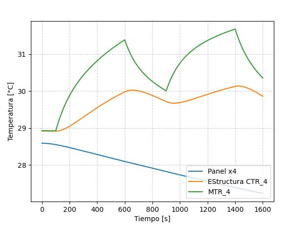

🛰️ Thermal Simulation of a Satellite Subsystem

This project models the thermal behavior of a satellite subsystem using the Finite Difference Method (FDM). It calculates node temperatures over time for various spacecraft components, including radiators, structures, and multilayer insulation (MLI).

✅ This script has been validated with thermal data from SAC-A, the first scientific satellite developed by Argentina.

In addition to the main implementation, the repository includes a large number of test cases with different power profiles and surface configurations. These serve as validation and comparison benchmarks for thermal engineers.

📂 Files Included

MOD_16_NODO_T_N.py: Main script that defines the thermal network, nodes, conductances, admittances, and solves the transient temperature distribution.

solve.py: Custom solver implementing explicit finite difference methods for thermal analysis.

MOD_32_VariacionPotencia_*.py: Parameter variation scripts to test sensitivity to power input.

Dos placas paralelas*.py: Simplified geometries for validation and educational purposes.

PLACAS PARALELAS (Al) d=3mm.png: Visual reference for physical configuration.

🧠 How It Works

Nodes represent physical components with thermal mass and initial temperature.

Conductive and radiative links between nodes are modeled via conductances and admittances.

The FDMExplicit solver calculates the time evolution of each node's temperature.

▶️ How to Run

Make sure Python 2 is installed.

Run the main script:

python MOD_16_NODO_T_N.py

You may also run any of the example files (e.g., MOD_32_VariacionPotencia_C15_3o.py) to explore thermal responses to varying power inputs.

🧪 Validation

This code has been benchmarked using thermal test data and design experience from SAC-A, the first Argentine scientific satellite launched in 1998. Additional simulations with variations in power (15 W to 90 W) and geometry provide robustness and reliability to the method.

👩‍💻 Author

Mariela BaigorriaThermal Engineer | Satellite Systems | Python Developergithub.com/Marita21

📜 License

MIT License

  

